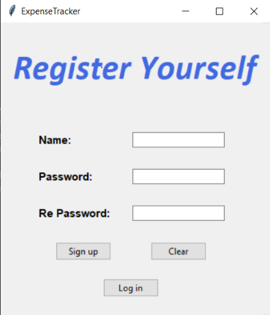

# Expense Tracker – Python Mini Project

A simple and intuitive Python application to track incomes and expenses, visualize monthly spending, and manage your personal finances securely.

---

## **Project Overview**

Expense Tracker is a Python mini project developed as part of the Programming in Python course at Shri Bhagubhai Mafatlal Polytechnic. It allows users to create accounts, log in securely, add incomes and expenses, and view monthly expense charts. All data is stored in a MySQL database for persistent tracking.

---

## **Features**

- User registration and secure login
- Add income with source and date
- Add expenses with category and date
- Prevents expenses from exceeding total income
- Interactive monthly pie chart of expenses and savings
- All data is stored and updated in a MySQL database

---

## **Software Requirements**

- Python 3.9
- XAMPP (MySQL Server)

---

## **Hardware Requirements**

- Windows 7 or higher (32/64-bit)
- Intel i3 processor (1.30 GHz or better)
- Minimum 4GB RAM
- 250GB free disk space

---

## **Installation \& Setup**

1. **Install Required Python Libraries:**

```bash
pip install mysql-connector-python
pip install tkcalendar
```

2. **Database Setup:**
    - Start your XAMPP server and ensure MySQL is running.
    - Create a new database named `expensetracker`.
    - Import the `expensetracker.sql` file into the `expensetracker` database.
3. **Run the Application:**
    - Execute the `main.py` file to start the Expense Tracker.

```bash
python main.py
```


---

## **Prototype Images**

  
  


---

## **Future Scope**

- Add support for recurring transactions
- Export reports to CSV or PDF
- Mobile and web versions for broader accessibility
- Enhanced data visualization and analytics

---

## **Author**

Aayush Nayan Patel,
Shri Bhagubhai Mafatlal Polytechnic,
Roll No: 1991035

---

## **License**

This project is for educational purposes and does not carry a specific license.

---

